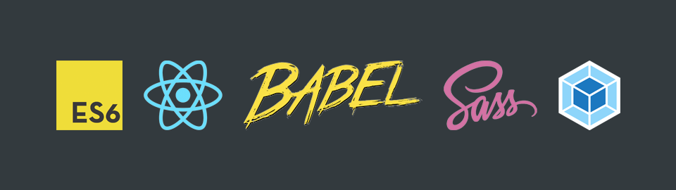

# React Starter

A starter kit for creating distributed React component libraries.



## Features


- Uses Babel 7 config for ES modules and ES syntax support
- Support for Create React App (CRA) projects out of the box
- Support for CSS/SCSS modules (`component.module.scss`) and importing dependency library styles such as Semantic UI CSS
- Uses Webpack to obfuscate and compress the build into a ready-to-distribute npm module

## Getting Started

1. Clone the repo:
    ```
    git clone https://github.com/tamert/react-starter.git
    ```
2. Run `yarn` to install dev dependencies. Add more as needed.
3. Run `yarn start` to develop.

## Publishing

1. Modify the README.md as documentation for your component library which will be published with your distributed build.
2. Modify CONTRIBUTING.md as internal documentation for your team or contributors.
3. Update the name of your package and version in `package.json`.
4. Make sure to commit changes before publishing since publishing resets your git to a clean state after building.
5. Run `npm publish` to publish your distributed build.

## License

MIT
